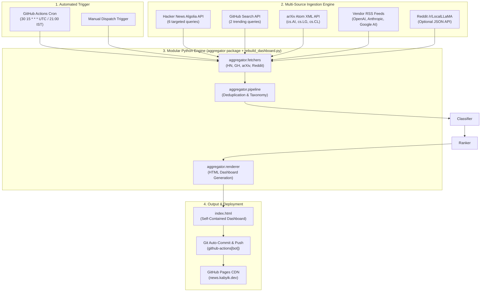

# Architecture Specification: Autonomous AI News Platform

## System Overview

The **Autonomous AI News Platform** is a zero-maintenance, cloud-native news aggregator that automatically harvests, filters, ranks, and publishes daily developments across four key AI domains: **Agents**, **Infra**, **Applied AI**, and **Open-source**.

The platform operates entirely in the cloud using **GitHub Actions** and a **Python Execution Engine**, removing all dependencies on local desktop environments, manual triggers, or third-party paid services.

---

## High-Level Architecture Diagram

---

## Taxonomy & Domain Bundles

Data is categorized into four structured lanes, each with specific content criteria:

| Domain Bundle | Primary Focus | Primary Sources | Header Accent Color |
| :--- | :--- | :--- | :--- |
| **Agents** | AI agent frameworks, autonomous systems, security, governance, tool calling | HN Algolia (`query=AI+agent`), arXiv (`cs.AI`), RSS | `#4f46e5` (Indigo) |
| **Infra** | GPUs, inference engines (vLLM/SGLang), datacenters, CUDA, chip releases | HN Algolia (`GPU`, `inference`, `Nvidia`, `datacenter`), GitHub (`inference`, `CUDA`), arXiv (`cs.LG`) | `#0891b2` (Cyan) |
| **Applied AI** | Product deployments, policy, coding tools, legal/ethics, industry impact | HN Algolia (`query=AI`), RSS | `#059669` (Emerald) |
| **Open-source** | Trending GitHub repositories (LLMs, agent frameworks, inference tools) | GitHub Search API (`stars`, `created:>30d`) | `#d97706` (Amber) |

---

## Data Pipeline Mechanics

### 1. Ingestion & Time Horizon
- **Time Window**: Ingests items published within the last **48 hours** (`created_at_i > unix_now - 172800`).
- **GitHub Horizon**: Captures trending repositories created within the last **30 days** (`created:>YYYY-MM-DD`).

### 2. Multi-Query Strategy for Hacker News
To prevent empty columns (such as the Infra bundle being undersupplied by narrow AND queries), the engine issues single-keyword queries and merges the resulting candidate lists:
- `query=GPU`
- `query=inference`
- `query=Nvidia`
- `query=datacenter`

Candidate hits are deduplicated by `objectID` and filtered against a negative keyword list (e.g. consumer gaming GPUs, generic market reports).

### 3. Deduplication & Cross-Source Canonicalization
- Deduplication key: Normalized canonical URL or GitHub repo full name (`owner/repo`).
- If an item appears in both HN and Open-source, it is assigned to the domain with higher signal density, preventing duplicate entries across columns.

### 4. Ranking & Density Rules
- Each column displays up to **7 items**.
- **HN items**: Sorted by points descending.
- **GitHub repos**: Sorted by stargazers count descending.
- **arXiv papers**: Sorted by submission date descending.
- **Quiet Column Fallback**: If a column has 0 items after filtering, a clean styled notice is displayed: *"No qualifying stories broke through in the last 48h."*

---

## Render & Deployment Guarantees

1. **Zero External Runtime Dependencies**:
   - `index.html` contains 100% inline CSS and system fonts.
   - Requires no external JS libraries, Tailwind CDN, or third-party web fonts.
2. **Deterministic Output**:
   - Running the script with identical API inputs produces reproducible HTML markup.
3. **Idempotence & Git Safety**:
   - The workflow checks if `index.html` has actual content changes before committing. If no new stories or structural changes occurred, no redundant commit is pushed.
